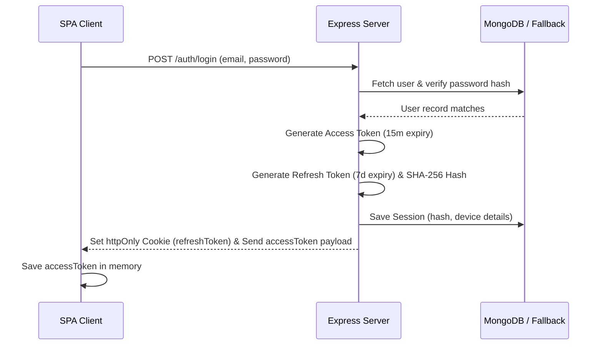
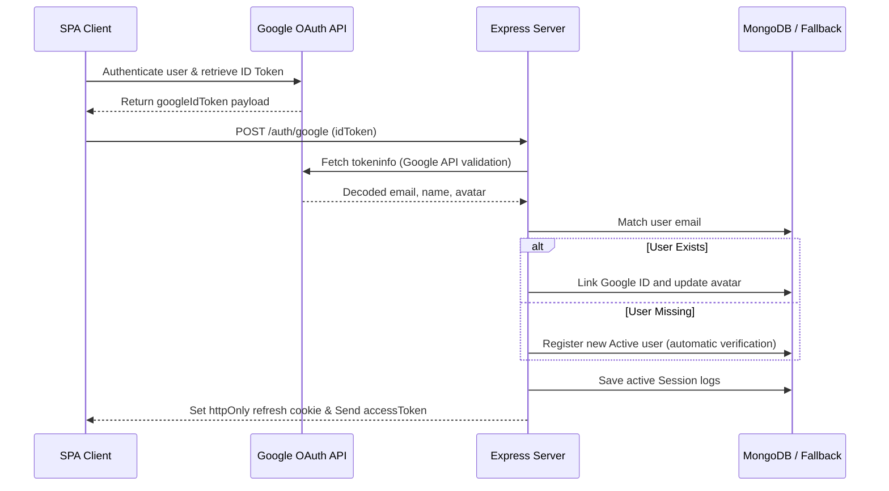

# StayMate — Authentication & Authorization Architecture

This document outlines the security specifications, JWT session details, Google OAuth account linking flows, and the hybrid RBAC/PBAC access control architecture for the **StayMate** application.

---

## 1. Authentication Architecture

StayMate utilizes a state-of-the-art token-based authentication system combining short-lived Access Tokens (stored in-memory on the client) and rotated Refresh Tokens stored in secure browser cookies.

### Key Security Implementations:
1.  **Access Token:** Short-lived JWT (expiry: 15 minutes) contains the user ID, role, and authorization version. It is transmitted in HTTP request `Authorization: Bearer <token>` headers.
2.  **Refresh Token:** Long-lived token (expiry: 7 days) stored in a secure `httpOnly`, `sameSite: strict`, and `secure: true` (production only) cookie.
3.  **Refresh Token Rotation (RTR):** Every time a client rotates their token, the old token is invalidated/deleted and a fresh rotated cookie pair is issued. This prevents token replay attacks.
4.  **Session Revocation:** On password reset, logout, or account modifications, the user's `authVersion` on the database document is incremented. Any active accessTokens signed with the old version are rejected instantly.

---

## 2. Google OAuth Integration Flow

---

## 3. Hybrid Authorization Model (RBAC + PBAC)

StayMate implements a linear progressive role-based model coupled with granular permission-based overrides.

### Progressive Linear Chain:
$$\text{Guest} \rightarrow \text{Tenant} \rightarrow \text{Owner} \rightarrow \text{Moderator} \rightarrow \text{Admin}$$

### Permission Tokens Union:
Access is evaluated by computing the union of:
1.  **Static permissions** assigned to the user's active `role` (e.g., `property:create` for Owners).
2.  **Custom permission overrides** stored directly inside the user's database document (`customPermissions` array).

*Example:* A Tenant user (`tenant`) normally cannot list properties. However, if a tenant has `'property:create'` added directly to their `customPermissions` array, the authorization middleware resolves their permissions union and grants them access to listing creation endpoints.

---

## 4. Environment Variables Checklist

The backend validates all variables immediately on startup:
*   `JWT_SECRET` — Signs access token.
*   `JWT_REFRESH_SECRET` — Signs rotated cookies.
*   `MONGODB_URI` — Database connection URI.
*   `CLIENT_URL` / `SERVER_URL` — CORS filters.
*   `COOKIE_SECRET` — Secures cookie parsers.
*   `GOOGLE_CLIENT_ID` / `GOOGLE_CLIENT_SECRET` — Google API verification keys.
*   `CLOUDINARY_NAME` / `CLOUDINARY_API_KEY` / `CLOUDINARY_SECRET` — Cloudinary media upload credentials.
