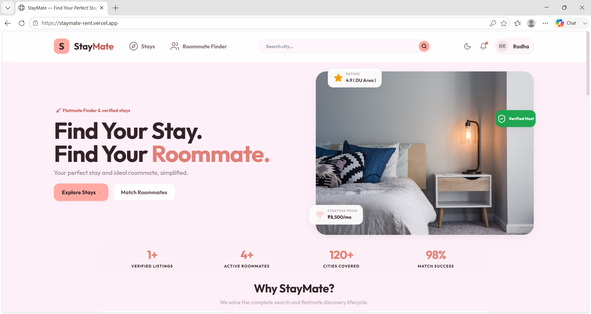
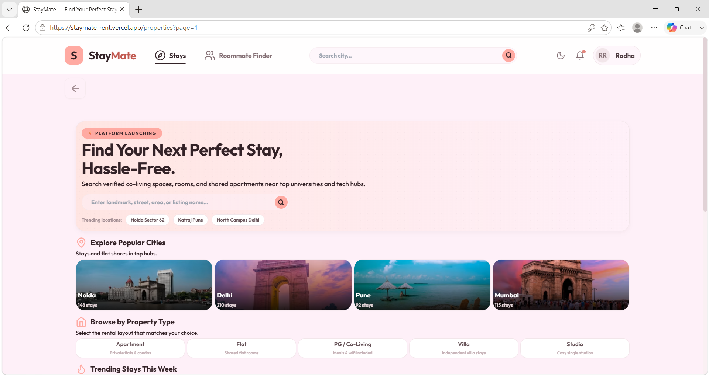
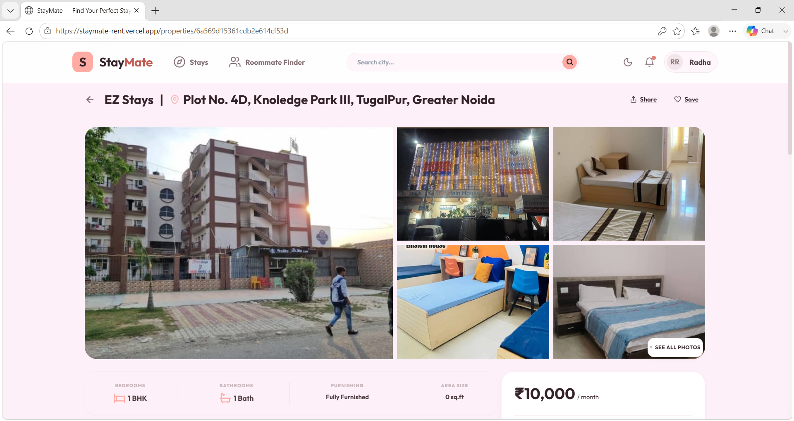
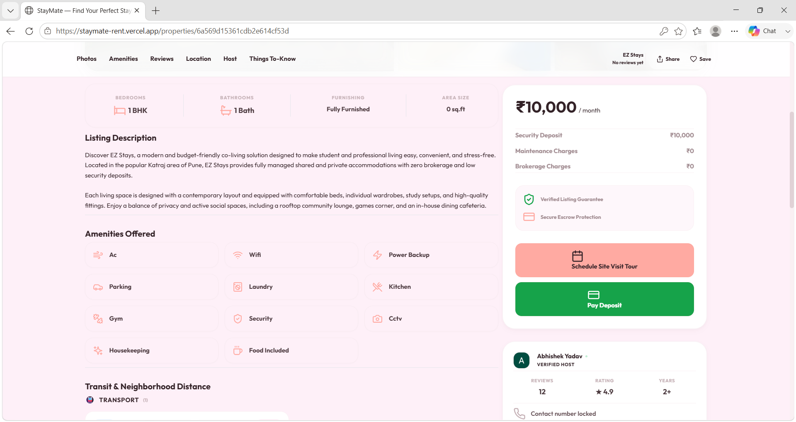
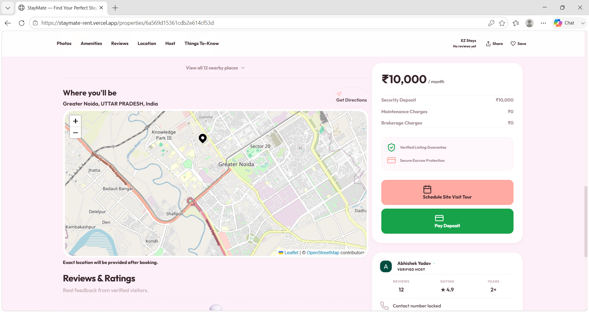
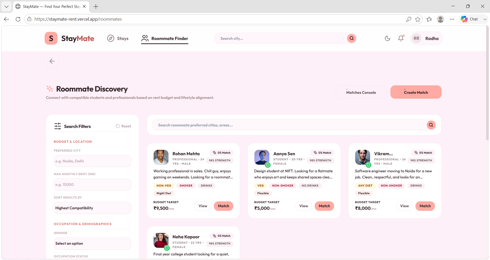
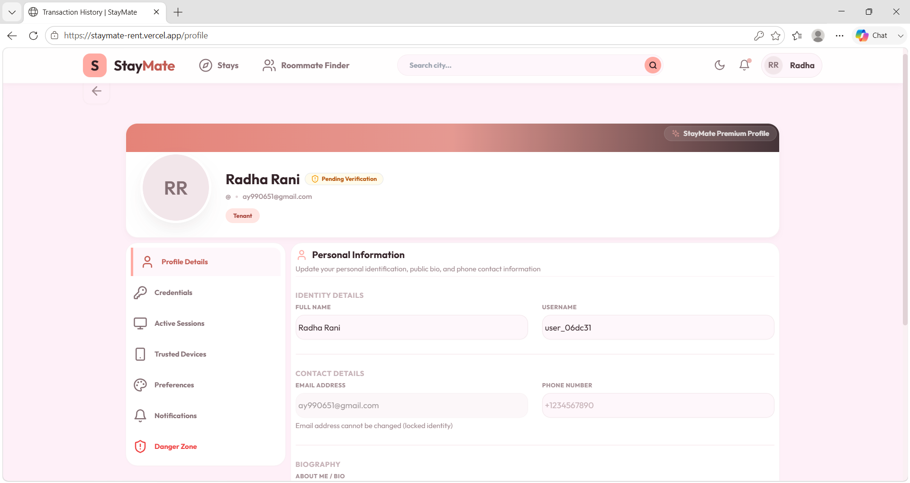
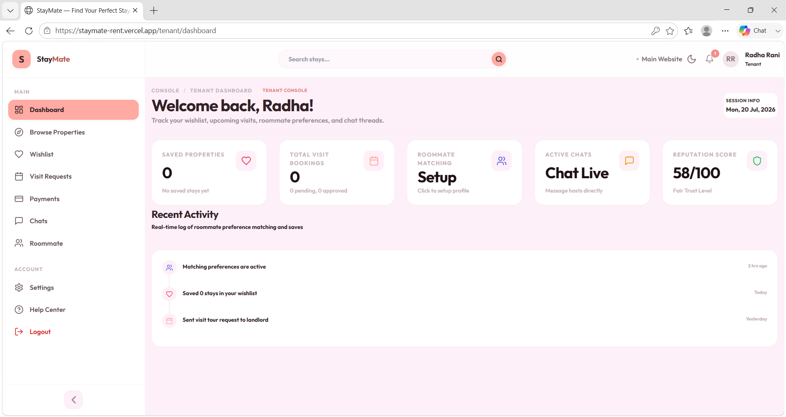
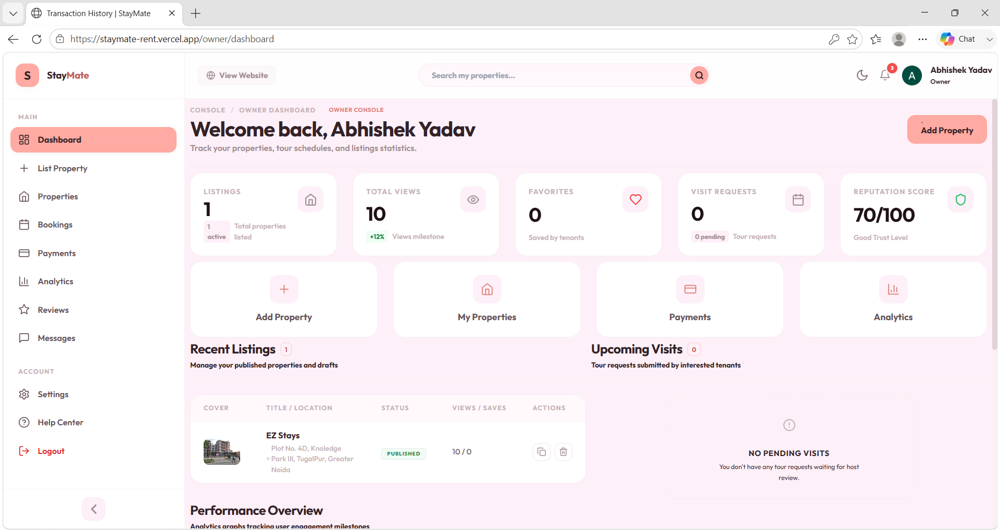
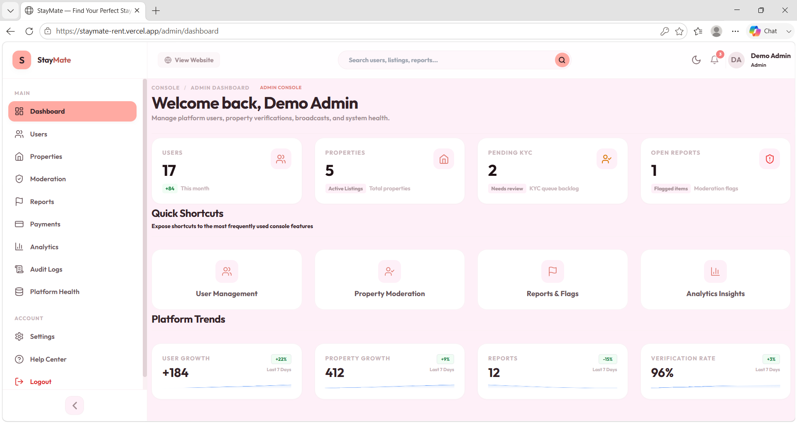

<div align="center">

# 🏠 StayMate

### Find Your Perfect Stay. Find Your Perfect Roommate.

A modern accommodation discovery platform built for students and working professionals that simplifies the complete rental journey—from finding verified properties to discovering compatible roommates.

[](https://react.dev/)
[](https://nodejs.org/)
[](https://www.mongodb.com/)
[](https://socket.io/)
[](https://vitejs.dev/)
[](LICENSE)

</div>

---

# 🌐 Live Demo

### 🚀 Frontend

https://staymate-rent.vercel.app/

### ⚙️ Backend API

https://staymate-backend-3oi4.onrender.com/

---

# 📖 About

StayMate is a full-stack accommodation platform that helps students and working professionals discover verified rental properties and compatible roommates in one place.

The platform streamlines the complete renting experience by providing secure authentication, property management, roommate matching, visit scheduling, real-time communication, and role-based dashboards for tenants, owners, moderators, and administrators.

---

# ✨ Features

## 🔐 Authentication

- Email & Password Authentication
- Google OAuth Login
- Email Verification
- JWT Authentication
- Secure Cookie Sessions
- Password Reset
- Protected Routes

## 🏠 Property Management

- Browse Verified Properties
- Advanced Search & Filters
- Property Details
- Image Gallery
- Amenities Section
- Host Information
- Property Reviews
- Wishlist

## 👥 Roommate Finder

- Smart Roommate Matching
- Budget Preferences
- Lifestyle Preferences
- City Based Search
- Compatibility Profiles

## 📅 Booking System

- Schedule Property Visits
- Booking Requests
- Payment Ready Architecture
- Razorpay Integration

## 💬 Communication

- Socket.io Real-Time Chat
- Notifications
- Live Messaging

## 📊 Dashboards

### Tenant Dashboard

- Wishlist
- Visit Requests
- Roommate Matches
- Chats
- Payments
- Activity Timeline

### Owner Dashboard

- Property Listings
- Analytics
- Visit Requests
- Payments
- Reviews
- Listing Management

### Admin Dashboard

- User Management
- Property Verification
- Moderation
- Reports
- Analytics
- Platform Health
- Audit Logs

---

# 🛠 Tech Stack

## Frontend

- React 19
- Vite
- Tailwind CSS
- React Router
- Context API
- Axios
- React Hook Form

## Backend

- Node.js
- Express.js
- Socket.io
- JWT
- bcryptjs
- Nodemailer
- Cloudinary

## Database

- MongoDB Atlas
- Mongoose

## Maps & Location

- Leaflet
- OpenStreetMap
- Nominatim API

## Authentication

- Google OAuth
- JWT
- Cookie Authentication

## Deployment

- Vercel
- Render

---

# 📸 Application Preview

## 🏠 Home Page



---

## 🔍 Property Discovery

Browse verified stays with smart filtering and search.



---

## 🏡 Property Details

Detailed property page with pricing, host information, amenities, reviews, and booking options.



---

## ✨ Amenities & Booking

View amenities, pricing breakdown, and booking actions.



---

## 🗺️ Interactive Map

Property location powered by Leaflet and OpenStreetMap.



---

## 👥 Roommate Finder

Find compatible roommates based on lifestyle, city, and budget.



---

## 👤 User Profile

Manage profile, credentials, devices, and preferences.



---

## 👨‍💼 Tenant Dashboard

Track bookings, chats, wishlist, and roommate preferences.



---

## 🏢 Owner Dashboard

Manage properties, analytics, payments, and visit requests.



---

## 🛡️ Admin Dashboard

Manage users, property verification, reports, moderation, and platform analytics.



---

# 📂 Project Structure

```
StayMate
│
├── frontend
│   ├── src
│   ├── public
│   └── package.json
│
├── backend
│   ├── controllers
│   ├── middleware
│   ├── models
│   ├── routes
│   ├── services
│   ├── utils
│   └── package.json
│
├── Assets
│
└── README.md
```

---

# ⚙️ Installation

## Clone Repository

```bash
git clone https://github.com/your-username/StayMate.git

cd StayMate
```

## Install Dependencies

```bash
npm install
```

Install frontend

```bash
cd frontend
npm install
```

Install backend

```bash
cd backend
npm install
```

---

# 🔑 Environment Variables

Create `.env` files inside both frontend and backend directories.

### Backend

```
PORT=

MONGODB_URI=

JWT_SECRET=

JWT_REFRESH_SECRET=

CLIENT_URL=

EMAIL_USER=

EMAIL_PASS=

GOOGLE_CLIENT_ID=

GOOGLE_CLIENT_SECRET=

CLOUDINARY_CLOUD_NAME=

CLOUDINARY_API_KEY=

CLOUDINARY_API_SECRET=

RAZORPAY_KEY_ID=

RAZORPAY_KEY_SECRET=
```

### Frontend

```
VITE_API_URL=

VITE_BACKEND_URL=

VITE_GOOGLE_CLIENT_ID=
```

---

# ▶️ Running the Project

Start Backend

```bash
cd backend
npm run dev
```

Start Frontend

```bash
cd frontend
npm run dev
```

---

# 🔒 Security Features

- JWT Authentication
- Secure Cookies
- Password Hashing (bcrypt)
- Email Verification
- Google OAuth
- Session Validation
- Protected APIs
- Role Based Access Control
- Input Validation
- Secure Environment Variables

---

# 🚀 Future Enhancements

- AI Property Recommendation
- AI Roommate Matching
- Push Notifications
- Video Property Tours
- Mobile Application
- Multi-language Support
- Property Recommendation Engine
- Advanced Analytics

---

# 🤝 Contributing

Contributions are welcome!

1. Fork the repository

2. Create a feature branch

```
git checkout -b feature/YourFeature
```

3. Commit changes

```
git commit -m "Add new feature"
```

4. Push

```
git push origin feature/YourFeature
```

5. Open a Pull Request

---

# 👨‍💻 Author

**Abhishek Yadav**

B.Tech CSE | Full Stack Developer | MERN Stack | Problem Solver

GitHub: https://github.com/Abhi3620v

LinkedIn: https://www.linkedin.com/in/abhishekyadav4653/

---

# ⭐ Support

If you found this project helpful, consider giving it a ⭐ on GitHub. It motivates me to build and share more open-source projects.

---

<div align="center">

### ⭐ Thank you for visiting StayMate ⭐

</div>
